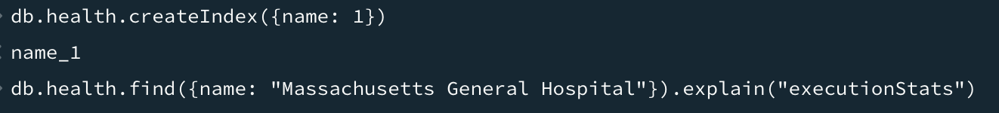

# SBA 319: MongoDB Database Application

## To Use This App


This Node.js application uses Express.js for routing and MongoDB with Mongoose for database operations.

- It imports necessary modules and sets up an Express router.

- It defines several routes for different operations:

      -   Routes for rendering different pages (/about, /quiz, /trivia).
      -   A route for redirecting to the college page (/help).
      -   Routes for handling college-related operations:
          - POST /create to create a new college.
          - GET /update/:id to get a college for updating.
          - POST /update/:id to update a college.
          - PATCH /college/:id to update a college partially.
          - GET /college to get all colleges or colleges filtered by ZIP code.
          - GET /college/:id to get details of a specific college.
          - DELETE /college/:id to delete a college.

  -Each route handler contains the necessary logic to interact with the database (MongoDB) using Mongoose for CRUD operations.

## My Routes:

<span style="color: red;">

### Get the about page

```
router.get("/about", (req, res) => {
  res.render("about");
});
```

### Get the quiz

```
router.get("/quiz", (req, res) => {
  res.render("quiz");
});
```

### Get the trivia

```
router.get("/trivia", (req, res) => {
  res.render("trivia");
});
```

### Redirect help page to the college page

```
router.get("/help", (req, res) => {
  res.redirect("/college");
});
```

### Query the database for the names only

```
// http://localhost:3000/college/name?name
router.get("/college/name", async (req, res) => {
  try {
    let names = await College.find({}, 'name'); 
    res.json({ names: names });
  } catch (error) {
    console.log(error.message);
    res.status(500).json({ error: 'Internal server error' });
  }
});
```

### Get an updated resource in the update form

```
router.get("/update/:id", async (req, res) => {
  const id = req.params.id;
  try {
    const college = await College.findById(id);
    if (!college) {
      return res.status(404).json({ error: "College not found" });
    }
    res.render("create_data", { college: college });
  } catch (error) {
    console.log(error);
    res.status(500).json({ error: "Failed to fetch college for update" });
  }
});
```

### Create a new resource in Postman:

```
router.post("/college", async (req, res) => {
  try {
    const college = await College.create(req.body);
    res.status(200).json(college);
  } catch (error) {
    console.log(error.message);
    res.status(500).json({ message: error.message });
  }
});
router.post("/attraction", async () => {})
router.post("/health", async ()=>{}),
```

### Create a resource in the update form

```
router.post("/update/:id", async (req, res) => {
  const id = req.params.id;
  try {
    const updatedCollege = await College.findByIdAndUpdate(id, req.body, {
      new: true,
    });
    // res.render("create_data", { college: updatedCollege });
    res.redirect("/college");
  } catch (error) {
    console.log(error);
    res.status(500).json({ error: "Failed to update college" });
  }
});
```

### Create a resource in the regular form - change the action in the form as is necessary

```
router.post("/create", (req, res) => {
  res.render("createResource", { event: {} });
});
### Update a resource in the update form
router.patch("/college/:id", async (req, res) => {
  try {
    const id = req.params.id;
    const updatedCollege = await College.findByIdAndUpdate(id, req.body, {
      new: true,
    });

    if (!updatedCollege) {
      return res.status(404).json({ error: "College not found" });
    }

    res.render("create_data", { college: updatedCollege });
  } catch (error) {
    console.log(error);
    res.status(500).json({ error: "Failed to update college" });
  }
});

router.patch("/attraction/:id", async ()=>{}),
router.patch("/health/:id", async ()=>{}),
```

### Get all available resources or get by zip

```
router.get("/college", async (req, res) => {
  try {
    // Retrieve college based on the ZIP code (if provided)
    const zip = req.query.zip;
    const colleges = zip
      ? await College.find({ zip: zip })
      : await College.find();

    // Render the "college" page with the list of colleges
    res.render("colleges", { colleges: colleges });
  } catch (error) {
    console.error(error);
    res.status(500).json({ error: "college document not available" });
  }
});

router.get("/attraction", async ()=>{}),
router.get("/health", async ()=>{}),
```

### Get one resource

```
router.get("/college/:id", async (req, res) => {
  const id = req.params.id;
  console.log(id);
  await College.findById(id)
    .then((result) => {
      console.log(result);
      res.render("showCollege", { college: result });
    })
    .catch((error) => {
      console.log(error);
    });
});


router.get("/attraction/:id", async ()=>{}),
router.get("/:id", async ()=>{}),
```

### Delete a resource

```
router.delete("/college/:id", (req, res) => {
  const id = req.params.id;
  College.findByIdAndDelete(id)
    .then((result) => {
      res.json({ redirect: "/college" });
    })
    .catch((error) => {
      console.log(error);
      res.status(500).json({ error: "Did not delete" });
    });
});

router.delete("/attraction/:id", async ()=>{}),
router.delete("/health/:id", async ()=>{}),
```

</span>

data, using the browser, the rest-client extension in VSCode or using Postman. All routes are equipped with a form to create data, and a button to delete data, but only the college route is equipped with a form to update data, and an edit button. Also available in the app will be trivia about Boston, a quiz on some scary Boston history, and some pictures about Boston.

## MongDB Validation Rules

```
import mongoose from "mongoose";

const attractionSchema = mongoose.Schema(
 {
   name: {
     type: String,
     required: true,
   },
   webpage: {
     type: String,
     required: true,
   },
   phone: {
     type: String,
     required: true,
   },
   street: {
     type: String,
     required: true,
   },
   city: {
     type: String,
     required: true,
   },
   state: {
     type: String,
     required: true,
   },
   zip: {
     type: String,
     required: true,
   },
   description: {
     type: String,
     required: true,
   },
 },
 { timestamps: true },
);

const Attractions = mongoose.model("Attractions", attractionSchema);

export default Attractions;
```
## My Indexes


## My Query

## My Validation Error


## Execution Stats


## Create an index


## Introduction

This assessment measures your understanding of MongoDB and your capability to implement its features in a practical manner. You have creative freedom in the topic, material, and purpose of the web application you will be developing, so have fun with it! However, remember to plan the scope of your project to the timeline you have been given.
This assessment has a total duration of three (3) days. This is a take-home assessment.
You have three total days (including weekends and holidays) to work on this assessment. This assessment will be due at 5:00pm on the third day after it is assigned. Your instructor will provide you with at least four hours of class time to work on the assessment, during which time you may discuss details of the project with them, including topic, scope, and implementation.

## Objectives

- Create a server application with Node, Express, and MongoDB.
- Create a CRUD API using Express and MongoDB.
- Create MongoDB indexes.
- Use MongoDB indexing to make efficient queries.
- Create MongoDB validation rules.
- Use MongoDB validation to ensure data consistency.

## Submission

Submit the link to your completed assessment using the Start Assignment button on the Assignment page in Canvas.
Your submission should include:
A link to the GitHub repository for your project.

## Instructions

- You will create a small Node, Express, and MongoDB server application. - The topic and content of this application is entirely up to you; be creative!
- Your work will be graded according to the technical requirements listed in the following section. Creativity and effort always work in your favor, so feel free to go beyond the scope of the listed requirements if you have the time.
- Keep things simple. Like most projects you will encounter, you should finish the absolute minimum requirements first, and then add additional features and complexity if you have the time to do so. This will also help you understand what you can get done in a specific allotment of time if you were to be asked to do something similar in the future.
- Once you have an idea in mind, briefly discuss it with your instructors to determine if it is appropriate for the amount of time you have been given.
- Since topic and content are secondary to functionality for this assessment, we have included some resources below for free content that you can use to populate your application. Once you have gotten your functionality in place, you can return and fill in the content with something interesting.

### Resources for free content:

- Text: Lipsum, a Lorem Ipsum text generator.
- Images: Pexels, a resource for stock photos (and other media).
- GIFs: Motion Elements, a resource for GIFs (and other media).

### Requirements

The requirements listed here are absolute minimums. Ensure that your application meets these requirements before attempting to further expand your features.
Create your application locally, and initialize a local git repo. Make frequent commits to the repo. When your application is complete, push your repo to GitHub and submit the link to the GitHub page using the submission instructions at the top of this document.

### Bonus Objectives

The objectives listed here are not required. Ensure that your application meets the requirements above before attempting to further expand your features.
These bonus objectives cannot increase your overall score above 100%. Successful completion of these objectives can; however, make up for lost points above. Ensure your application works as outlined by the requirements above before attempting these objectives, time permitting.

### Reflection (Optional)

Once you have completed your project, answer the following questions to help solidify your understanding of the process and its outcomes, as well as improve your ability to handle similar tasks in the future.
What could you have done differently during the planning stages of your project to make the execution easier?
Were there any requirements that were difficult to implement? What do you think would make them easier to implement in future projects?
What would you add to or change about your application if given more time?
Use this space to make notes for your future self about anything that you think is important to remember about this process, or that may aid you when attempting something similar again:

### References

Tishana Trainor: Teacher,
Manara Ali: Teacher,
Classmates,
Academind: YouTube,
Caleb Curry: YouTube,
DCode: YouTube,
Net Ninja: YouTube,
Devtamin: YouTube,
Google,
Stack Overflow,
Medium,
NodeJS docs,
MongoDB docs,
Mongoose docs,
ChatGPT

### Technology

express, mongoose, mongodb, nodeJS, morgan, dotenv, html, css, VSCode, MacBook, Google Dev Tools, Slack,
